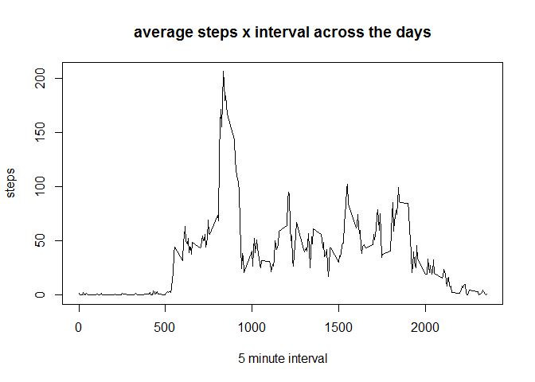
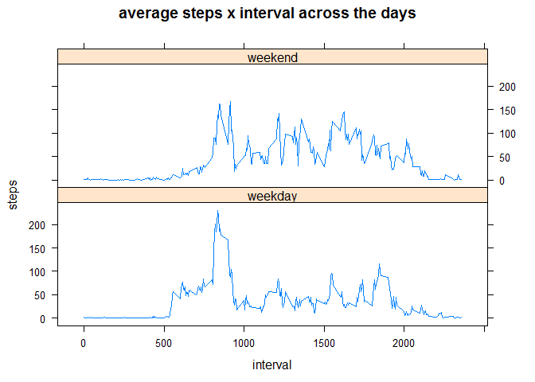

# Reproducible Research: Peer Assessment 1
Paolino Massimo Budroni  

## Loading and preprocessing the data

We assume the data file has been already downloaded, unzipped and make available in the working directory.


```r
# reading the file
activity_df <- read.csv('./activity.csv')
dim(activity_df)
```

```
## [1] 17568     3
```

```r
# check NA values
sum(is.na(activity_df))
```

```
## [1] 2304
```

```r
# 
round(sum(is.na(activity_df))/dim(activity_df)[1]*100,0)
```

```
## [1] 13
```

As reported by the previuous code, the Activity Data File contains around 13% of rows with NA values. This could introduce some noise in the calculations and summarization of the data. In the next section called **Inputing Missing Values**, these NA values will be replaced with a significant value. 


## What is the mean total number of steps taken per day?

The following code will calculate mean e median of the total number of steps per day. An histogram of total number of steps per day will be also plotted.
Na Values will be ignored using the parameter na.rm=true 


```r
# mean e median of total number steps per day
mean(rowsum(activity_df$steps,activity_df$date,na.rm=TRUE))
```

```
## [1] 9354.23
```

```r
median(rowsum(activity_df$steps,activity_df$date,na.rm=TRUE))
```

```
## [1] 10395
```

```r
# code to create an histogram reporting total steps per day
# ggplot2 will be used for this plot
library(ggplot2)

# creation of a summary data frame
activity_summary <- aggregate(steps ~ date, activity_df, sum)

# plot the summary
q <- qplot(date,steps,data=activity_summary,main="total steps per day",ylab ="steps", xlab="date",asp=0.4,geom=c("histogram"),stat="identity")
q + theme(axis.text.x = element_text(angle = 90, hjust = 1, face="bold", size=9))
```

 


## What is the average daily activity pattern?
In this section, the average number of steps per 5 minute interval will be calculated across all-days.The column interval reports a multiple of 5 starting from zero and ending to 2355.
Given that in an hour we have 12 interval of 5 minutes (0 to 55), this field reports values structured in the following way: x0->x55 where x start from 0 to 23.
In other words, if interval is equal to 845 then the interval taken in account is the one that starts at 8h40' and ended to 8h45' and so on. 
*Notice that x=0 as first digit is omitted.*


```r
# code to calculate the mean of steps per interval 
activity_mean_5i <- aggregate(steps ~ interval, activity_df, mean)

# plot 
plot(steps ~ interval,activity_mean_5i, type="l",xlab="5 minute interval",ylab="steps",main="average steps x interval across the days")
```

 

```r
# subsetting the max value
subset(activity_mean_5i,steps==max(activity_mean_5i$steps))
```

```
##     interval    steps
## 104      835 206.1698
```

The interval that contains the maximum average number of steps taken accross all-days is the one that starts at **8 and 30'** and ended at **8 and 35'** a.m. with a number of steps around to **206**. 

## Imputing missing values
In the previuos section we have stated (see the R-Code) that the original data file contains **2304** rows with NA values. In this section we will identified a strategy to fill in the missing values. The NA values will be replaced with the one calculated as mean of that interval across all-days.

In order to semplify the process we could also use a simplest way, that is **the mean of the column steps** to fill in the the rows with no regard the specific interval. 


```r
# copy the original to a new data file 
activity_good <- activity_df

# loop to update NA value to mean value per interval 
for (j in 1:nrow(activity_good))  {
    for (i in 1:nrow(activity_mean_5i) ) { 
      
      if (activity_good[j,c("interval")]==activity_mean_5i[i,c("interval")]) {
          if (is.na(activity_good[j,1]))  { 
            activity_good[j, "steps"] <- activity_mean_5i[i,"steps"]
          }
      }
    }
}

# check NA rows: result expected=0 
sum(is.na(activity_good))
```

```
## [1] 0
```

As shown by the above code, the new Data file doesn't contain any row with NA value. 
A plot showing the total steps per day will be created in the next section. 
Mean and Median will be calculated in order to see if they differ from the previuos ones above calculated.


```r
# creation of a new summary data frame
activity_g_summary <- aggregate(steps ~ date, activity_good, sum)

# plot the summary
q <- qplot(date,steps,data=activity_g_summary,main="total steps per day",ylab ="steps", xlab="date",asp=0.4,geom=c("histogram"),stat="identity")
q + theme(axis.text.x = element_text(angle = 90, hjust = 1, face="bold", size=9))
```

 

```r
# mean e median of total number steps per day of the new df
mean(activity_g_summary$steps)
```

```
## [1] 10766.19
```

```r
median(activity_g_summary$steps)
```

```
## [1] 10766.19
```

```r
# difference from the previuos mean
mean(activity_g_summary$steps)-mean(rowsum(activity_df$steps,activity_df$date,na.rm=TRUE))
```

```
## [1] 1411.959
```

```r
# remove of the summary df
rm(activity_g_summary)
```

As we can see, mean and median are different from the previuos, this means that fixing the NA values as we have done, it has a relevant impact expecially in the mean value, in fact it is increased by around **1412 steps per day, roughly 15%**.


## Are there differences in activity patterns between weekdays and weekends?
First step is add a new factor column evalueted with 2 level: **weekday** if the weekday is an integer between 1 and 5 and **weekend** if it is >= 6.
Weekday is an integer between 1 and 7 and is calculated with the following code.


```r
# code to assign a value to the new column daytype
for (j in 1:nrow(activity_good))  {
      if (as.integer(format.Date(activity_good[j,"date"],"%u")) >= 6) {
        activity_good[j,"daytype"] <- "weekend"  
      } else activity_good[j,"daytype"] <- "weekday"

}

activity_good$daytype <- as.factor(activity_good$daytype)

table(activity_good$daytype)
```

```
## 
## weekday weekend 
##   12960    4608
```

The data file contains **4608** observations taken during the all-weekends and **12960** taken during the all-weekdays. The average number of steps per 5 minute interval will be calculated across all-weekend days and in the same way across all-weekdays.
A graph showing both patterns will be plotted. 


```r
# calculate the mean across the days
activity_mean_dt_5i <- aggregate(steps ~ interval+daytype, data=activity_good, mean)

# identifying the interval with the max steps taken during the weekend and the weekday
subset(activity_mean_dt_5i,steps==max(subset(activity_mean_dt_5i,daytype=="weekend")$steps))
```

```
##     interval daytype    steps
## 400      915 weekend 166.6392
```

```r
subset(activity_mean_dt_5i,steps==max(subset(activity_mean_dt_5i,daytype=="weekday")$steps))
```

```
##     interval daytype    steps
## 104      835 weekday 230.3782
```

As we can see during the weekend the interval with the max steps is between **9h10 and 9h15** against the one during the weekdays that is between **8h30 and 8h35**
*Less steps on average during the weekends* 


```r
# for this plot the Lattice library will be used
library(lattice)

xyplot(steps ~ interval | daytype, data = activity_mean_dt_5i, layout = c(1, 2),type="l",main="average steps x interval across the days")
```

 

The plot confirm the different pattern between the weekend and weekdays. During the weekdays there is a peak between 8h30' and 8h50'with a peak of steps greater than the one observed during the weekend that is signicantly less.


